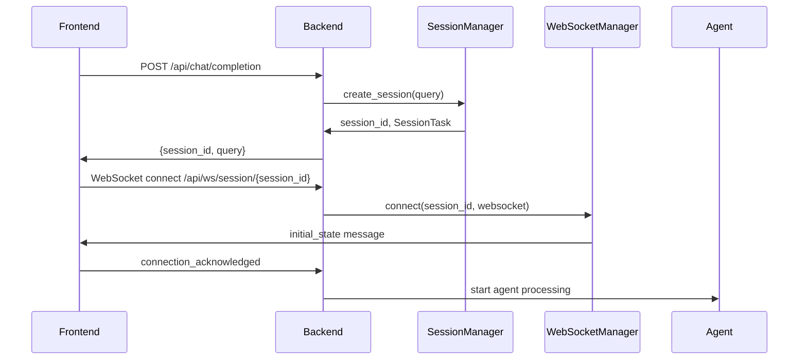

# FastAPI + React: AI Agent with Human-in-the-Loop Technical Architecture

## 🏗️ System Overview

This FastAPI + React application implements an AI agent system with human-in-the-loop capabilities, featuring real-time confirmations, session management, and WebSocket-based communication. The system allows users to interact with AI agents that can request permission before executing actions, handle user input dynamically, and maintain session state across reconnections.

## 📋 Table of Contents

1. [Architecture Overview](#architecture-overview)
2. [Backend Architecture](#backend-architecture)
3. [Frontend Architecture](#frontend-architecture)
4. [Communication Flow](#communication-flow)
5. [Session Management](#session-management)
6. [WebSocket Communication](#websocket-communication)
7. [Confirmation System](#confirmation-system)
8. [User Input Handling](#user-input-handling)
9. [State Management & Recovery](#state-management--recovery)
10. [Error Handling & Retry Logic](#error-handling--retry-logic)
11. [Security Considerations](#security-considerations)
12. [API Documentation](#api-documentation)

---

## 🏛️ Architecture Overview

```
┌─────────────────┐    HTTP/WebSocket     ┌─────────────────┐
│                 │ ◄──────────────────► │                 │
│  React Frontend │                       │  FastAPI        │
│  (Port 5173)    │                       │  Backend        │
│                 │                       │  (Port 8000)    │
└─────────────────┘                       └─────────────────┘
        │                                          │
        │                                          │
        ▼                                          ▼
┌─────────────────┐                       ┌─────────────────┐
│ WebSocket       │                       │ AI Agent        │
│ Connection      │                       │ (Azure OpenAI/  │
│ Management      │                       │  Ollama)        │
└─────────────────┘                       └─────────────────┘
        │                                          │
        │                                          │
        ▼                                          ▼
┌─────────────────┐                       ┌─────────────────┐
│ Session State   │                       │ Search Tools    │
│ Management      │                       │ (Google,        │
│                 │                       │  DuckDuckGo)    │
└─────────────────┘                       └─────────────────┘
```

### Key Components:
- **Frontend**: React SPA with real-time WebSocket communication
- **Backend**: FastAPI with async/await pattern for concurrent operations
- **AI Agent**: Agno framework with Azure OpenAI/Ollama integration
- **Session Management**: In-memory session store with reconnection support
- **WebSocket Manager**: Handles real-time bidirectional communication
- **State Recovery**: Persistent session state for connection recovery

---

## 🔧 Backend Architecture

### Core Structure

```
backend/
├── main.py                 # FastAPI app entry point
├── config.py              # Configuration and model setup
├── requirements.txt       # Dependencies
├── models/
│   └── types.py           # Pydantic models and data structures
├── routers/
│   ├── chat.py           # Chat completion endpoints
│   └── websocket.py      # WebSocket connection handling
├── service/
│   ├── session_manager.py    # Session lifecycle management
│   └── websocket_manager.py  # WebSocket connection management
└── task/
    └── task_manager.py    # Background task coordination
```

### 1. **FastAPI Application (`main.py`)**

```python
from fastapi import FastAPI
from fastapi.middleware.cors import CORSMiddleware
from routers.websocket import ws_router
from routers.chat import chat_router

app = FastAPI()

# CORS configuration for frontend
app.add_middleware(
    CORSMiddleware,
    allow_origins=["*"],
    allow_credentials=True,
    allow_methods=["*"],
    allow_headers=["*"],
)

# Include routers
app.include_router(ws_router)      # WebSocket endpoints
app.include_router(chat_router)    # HTTP API endpoints
```

### 2. **Session Management (`service/session_manager.py`)**

The `SessionManager` handles the lifecycle of user sessions:

```python
class SessionTask:
    def __init__(self, user_query: str):
        self.cancel_event = asyncio.Event()      # Task cancellation
        self.confirm_event = asyncio.Event()     # User confirmation
        self.confirmed = None                    # Confirmation result
        self.input_request = None                # Dynamic user input
        self.websocket_ready = asyncio.Event()   # WebSocket connection status
        self.task_started = asyncio.Event()      # Background task status
        self.connection_count = 0                # Track reconnections
        self.user_query = user_query             # Original user query
```

**Key Features:**
- **Session Isolation**: Each session has a unique UUID
- **Connection Tracking**: Supports multiple connections per session
- **Event Coordination**: Uses asyncio.Event for inter-task communication
- **Graceful Cleanup**: Automatic session cleanup when connections drop

### 3. **WebSocket Manager (`service/websocket_manager.py`)**

Manages WebSocket connections and state persistence:

```python
class WebSocketManager:
    def __init__(self):
        self.active_connections = {}     # session_id -> WebSocket
        self.session_states = {}         # Persistent state storage
        self.connection_locks = {}       # Per-session concurrency control
```

**Key Features:**
- **Connection Locks**: Prevents race conditions during reconnection
- **State Persistence**: Saves all messages for session recovery
- **Timeout Handling**: Graceful handling of connection timeouts
- **Message Queuing**: Messages saved even when client disconnected

### 4. **AI Agent Integration (`routers/chat.py`)**

Integrates with the Agno AI framework:

```python
agent = Agent(
    model=create_azure_openai_model(),
    name="Web Search Agent",
    description="An agent that performs web searches and retrieves information.",
    tools=[
        GoogleSearchTools(requires_confirmation_tools=["google_search"]), 
        DuckDuckGoTools(requires_confirmation_tools=["duckduckgo_search"]),
        ReasoningTools()
    ],
    tool_call_limit=5,
    show_tool_calls=False,
    markdown=True,
    debug_mode=True,
    reasoning=True
)
```

**Flow:**
1. Agent starts processing user query
2. When tool requires confirmation, agent pauses
3. System requests user confirmation via WebSocket
4. Agent continues based on user response
5. Streams response content in real-time

---

## ⚛️ Frontend Architecture

### Core Structure

```
frontend/
├── src/
│   ├── App.jsx           # Main application component
│   ├── App.css          # Styling
│   ├── main.jsx         # React entry point
│   └── index.css        # Global styles
├── package.json         # Dependencies and scripts
└── vite.config.js       # Vite configuration
```

### State Management

The React frontend uses useState hooks for managing application state:

```javascript
const [sessionId, setSessionId] = useState(null);           // Current session
const [taskStatus, setTaskStatus] = useState("idle");       // Task lifecycle
const [showConfirm, setShowConfirm] = useState(false);      // Confirmation modal
const [ws, setWs] = useState(null);                         // WebSocket connection
const [streamContent, setStreamContent] = useState([]);     // Streaming messages
const [agentResponse, setAgentResponse] = useState("");      // AI response
const [isGenerating, setIsGenerating] = useState(false);    // Generation status
const [userQuery, setUserQuery] = useState("");             // User input
```

### Component Hierarchy

```
App
├── User Query Input Section
├── Control Buttons (Start, Cancel, Clear)
├── Status Display
├── Current Task Display
├── Confirmation Dialog (conditional)
├── Input Request Dialog (conditional)
├── Retry Dialog (conditional)
├── Stream Content Display
└── Agent Response Display (with Markdown)
```

---

## 🔄 Communication Flow

### 1. **Task Initialization Flow**



### 2. **Real-time Communication**

**HTTP Endpoints:**
- `POST /api/chat/completion` - Start new task
- `POST /api/chat/cancel/{session_id}` - Cancel running task
- `GET /api/session/{session_id}` - Get session info

**WebSocket Messages:**

| Direction | Message Type | Purpose | Payload |
|-----------|--------------|---------|---------|
| Backend → Frontend | `task_started` | Task begins | `{type, content}` |
| Backend → Frontend | `generating` | Streaming response | `{type, data: {content, event}}` |
| Backend → Frontend | `request_confirmation` | Need user approval | `{type, message}` |
| Frontend → Backend | `confirm` | User response | `{type, value: boolean}` |
| Backend → Frontend | `request_user_input` | Need user data | `{type, fields}` |
| Frontend → Backend | `user_input` | User data | `{type, values}` |
| Backend → Frontend | `task_completed` | Task finished | `{type, content, values?}` |
| Backend → Frontend | `task_cancelled` | Task stopped | `{type, content}` |
| Backend → Frontend | `initial_state` | Session recovery | `{type, state_messages, state_count}` |

---

## 🗂️ Session Management

### Session Lifecycle

1. **Creation**: UUID generated, SessionTask created
2. **Connection**: WebSocket established, ready event set
3. **Processing**: Background task starts agent execution
4. **Interaction**: Human-in-the-loop events (confirmations, input)
5. **Completion**: Task completes, session maintained for potential reconnection
6. **Cleanup**: Session removed when all connections closed

### Reconnection Handling

```python
async def connect(self, session_id: str, websocket: WebSocket):
    # Restore session state
    if session_id in self.session_states:
        state_data = {
            "type": "initial_state",
            "state_messages": [entry["data"] for entry in self.session_states[session_id]],
            "state_count": len(self.session_states[session_id])
        }
    
    await websocket.accept()
    await websocket.send_json(state_data)
```

**Benefits:**
- Users can refresh page without losing progress
- Multiple browser tabs can connect to same session
- Network interruptions don't lose session state

---

## 🌐 WebSocket Communication

### Connection Management

```python
class WebSocketManager:
    async def send_json(self, session_id: str, data, save_state: bool = True):
        async with self.connection_locks[session_id]:  # Prevent race conditions
            ws = self.active_connections.get(session_id)
            if ws:
                try:
                    await asyncio.wait_for(ws.send_json(data), timeout=5.0)
                    if save_state:
                        self._save_state(session_id, data)
                except Exception as e:
                    # Save state even if send fails for replay
                    if save_state:
                        self._save_state(session_id, data)
```

**Features:**
- **Timeout Protection**: 5-second timeout prevents hanging
- **State Persistence**: Messages saved regardless of delivery success
- **Connection Locks**: Prevents concurrent send operations
- **Graceful Degradation**: Continues operation even with connection issues

### Message Queuing

When WebSocket is disconnected:
1. Messages continue to be saved to session state
2. Upon reconnection, all missed messages are replayed
3. Frontend reconstructs UI state from replayed messages

---

## ✅ Confirmation System

### Backend Confirmation Flow

```python
async def request_confirmation(session_id: str, message: str):
    task = session_manager.get_task(session_id)
    
    # Reset confirmation state
    task.confirm_event.clear()
    task.confirmed = None
    
    # Send confirmation request
    await ws_manager.send_json(session_id, {
        "type": "request_confirmation", 
        "message": message
    })
    
    # Wait for user response
    try:
        await asyncio.wait_for(task.confirm_event.wait(), timeout=30.0)
        return task.confirmed is True
    except asyncio.TimeoutError:
        return False
```

### Frontend Confirmation UI

```javascript
{showConfirm && (
  <div className="confirmation-dialog">
    <div>🤔 Agent Confirmation Required</div>
    <div>{confirmationMessage}</div>
    <button onClick={() => handleConfirm(true)}>✅ Yes, Continue</button>
    <button onClick={() => handleConfirm(false)}>❌ No, Cancel</button>
  </div>
)}
```

**Process:**
1. Agent encounters tool requiring confirmation
2. Backend sends `request_confirmation` message
3. Frontend shows modal dialog
4. User clicks Yes/No
5. Frontend sends `confirm` message with boolean value
6. Backend receives response, agent continues/stops accordingly

---

## 📝 User Input Handling

### Dynamic Input Requests

The system supports dynamic user input collection:

```python
class UserInputRequest:
    def __init__(self, fields):
        self.fields = fields     # Field definitions
        self.event = asyncio.Event()  # Completion signal
        self.values = None       # User-provided values

async def request_user_input(session_id: str, fields):
    task = session_manager.get_task(session_id)
    task.input_request = UserInputRequest(fields)
    
    await ws_manager.send_json(session_id, {
        "type": "request_user_input",
        "fields": fields  # [{name, description, type, value}]
    })
    
    await task.input_request.event.wait()
    return task.input_request.values
```

### Frontend Input Collection

```javascript
{inputFields && (
  <div className="input-dialog">
    <div>📝 Agent Requires Input</div>
    {inputFields.map((field) => (
      <div key={field.name}>
        <label>{field.description}:</label>
        <input
          type="text"
          value={inputValues[field.name] || ""}
          onChange={(e) => handleInputChange(e, field.name)}
          placeholder={`Enter ${field.description.toLowerCase()}...`}
        />
      </div>
    ))}
    <button onClick={handleInputSubmit}>📤 Submit Information</button>
  </div>
)}
```

---

## 🔄 State Management & Recovery

### State Persistence Strategy

```python
def _save_state(self, session_id: str, data):
    if session_id not in self.session_states:
        self.session_states[session_id] = []
    
    state_entry = {
        "timestamp": asyncio.get_event_loop().time(),
        "data": data
    }
    self.session_states[session_id].append(state_entry)
    
    # Keep only last 100 messages to prevent memory issues
    if len(self.session_states[session_id]) > 100:
        self.session_states[session_id] = self.session_states[session_id][-100:]
```

### Frontend State Recovery

```javascript
useEffect(() => {
  if (ws) {
    ws.onmessage = (event) => {
      const msg = JSON.parse(event.data);
      
      if (msg.type === "initial_state") {
        // Clear current state
        setStreamContent([]);
        setAgentResponse("");
        setIsGenerating(false);
        
        // Apply all saved state messages
        if (msg.state_messages && msg.state_messages.length > 0) {
          msg.state_messages.forEach((stateMsg) => {
            // Reconstruct UI state from each message
            if (stateMsg.type === "stream") {
              setStreamContent((prev) => [...prev, stateMsg.content]);
            } else if (stateMsg.type === "generating") {
              setAgentResponse((prev) => prev + stateMsg.data.content);
            }
            // ... handle other message types
          });
        }
      }
    };
  }
}, [ws]);
```

**Recovery Process:**
1. Frontend connects to existing session
2. Backend sends `initial_state` with all saved messages
3. Frontend replays messages to reconstruct UI state
4. User sees complete conversation history
5. Task continues from where it left off

---

## ⚠️ Error Handling & Retry Logic

### Backend Error Handling

```python
try:
    # Execute agent logic
    for run_response in agent.run(user_query, stream=True):
        # Process response...
        pass
except Exception as e:
    print(f"Error during agent execution: {e}")
    await ws_manager.send_json(session_id, {
        "type": "task_failed", 
        "error": str(e)
    }, save_state=True)
```

### Connection Resilience

```python
async def send_json(self, session_id: str, data, timeout: float = 5.0):
    try:
        await asyncio.wait_for(ws.send_json(data), timeout=timeout)
    except asyncio.TimeoutError:
        print(f"Timeout sending to {session_id}")
        # Save state for replay
        if save_state:
            self._save_state(session_id, data)
    except Exception as e:
        print(f"Error sending to {session_id}: {e}")
        # Continue execution, save state for recovery
        if save_state:
            self._save_state(session_id, data)
```

### Frontend Error Recovery

```javascript
ws.onerror = (error) => {
  console.error("WebSocket error:", error);
  setTaskStatus("error");
};

ws.onclose = () => {
  console.log("WebSocket closed");
  setTaskStatus("closed");
  // Automatic reconnection could be implemented here
};
```

---

## 🔒 Security Considerations

### 1. **Input Validation**

```python
@chat_router.post("/completion")
async def start_task(request: StartTaskRequest):
    user_query = request.query.strip()
    if not user_query:
        return JSONResponse(status_code=400, content={"error": "Query cannot be empty"})
    
    if len(user_query) > 500:
        return JSONResponse(status_code=400, content={"error": "Query too long"})
```

### 2. **Session Isolation**

- Each session has a unique UUID
- Sessions are isolated in memory
- No cross-session data leakage

### 3. **Connection Security**

```python
# CORS configuration
app.add_middleware(
    CORSMiddleware,
    allow_origins=["*"],  # Should be restricted in production
    allow_credentials=True,
    allow_methods=["*"],
    allow_headers=["*"],
)
```

### 4. **Resource Limits**

- Session state limited to 100 messages
- Input validation on all user data
- Timeout protection on all async operations

### 5. **Production Security Checklist**

- [ ] Restrict CORS origins to known domains
- [ ] Implement rate limiting
- [ ] Add authentication/authorization
- [ ] Use HTTPS/WSS in production
- [ ] Sanitize user inputs
- [ ] Implement request size limits
- [ ] Add logging and monitoring
- [ ] Use environment variables for secrets

---

## 📚 API Documentation

### HTTP Endpoints

#### POST `/api/chat/completion`
Start a new AI task.

**Request:**
```json
{
  "query": "Who is the current president of the United States?"
}
```

**Response:**
```json
{
  "session_id": "uuid-string",
  "query": "Who is the current president of the United States?"
}
```

#### POST `/api/chat/cancel/{session_id}`
Cancel a running task.

**Response:**
```json
{
  "status": "cancelled"
}
```

#### GET `/api/session/{session_id}`
Get session information.

**Response:**
```json
{
  "session_id": "uuid-string",
  "is_connected": true,
  "saved_state_messages": 15,
  "task_exists": true,
  "state_messages": [...]
}
```

### WebSocket Endpoint

#### WS `/api/ws/session/{session_id}`
Establish WebSocket connection for real-time communication.

**Message Types:**

**Backend → Frontend:**
- `initial_state`: Session recovery data
- `connection_ready`: Connection established
- `task_started`: Task execution begins
- `generating`: Streaming AI response
- `request_confirmation`: Request user approval
- `request_user_input`: Request user data
- `task_completed`: Task finished successfully
- `task_failed`: Task encountered error
- `task_cancelled`: Task was cancelled

**Frontend → Backend:**
- `connection_acknowledged`: Client ready
- `confirm`: User confirmation response
- `user_input`: User input data
- `cancel`: Cancel current task

---

## 🚀 Development Setup

### Backend Setup

```bash
cd backend
python -m venv venv
source venv/bin/activate  # On Windows: venv\Scripts\activate
pip install -r requirements.txt
uvicorn main:app --reload --host 0.0.0.0 --port 8000
```

### Frontend Setup

```bash
cd frontend
npm install
npm run dev
```

### Environment Variables

Create a `.env` file in the backend directory:

```env
AZURE_OPENAI_API_KEY=your_api_key
AZURE_OPENAI_ENDPOINT=your_endpoint
AZURE_OPENAI_DEPLOYMENT=your_deployment
AZURE_OPENAI_MODEL=gpt-4
AZURE_OPENAI_API_VERSION=2024-02-15-preview
```

---

## 🎯 Key Features Summary

1. **Human-in-the-Loop AI**: AI agents can request user confirmation before executing tools
2. **Real-time Communication**: WebSocket-based bidirectional communication
3. **Session Management**: Persistent sessions with reconnection support
4. **State Recovery**: Complete session state recovery after disconnection
5. **Streaming Responses**: Real-time AI response streaming with markdown support
6. **Dynamic Input**: AI can request arbitrary user input during execution
7. **Error Handling**: Graceful error handling with retry mechanisms
8. **Cancellation**: Users can cancel running tasks at any time
9. **Multi-connection**: Multiple browser tabs can connect to same session
10. **Modern UI**: React-based responsive interface with real-time updates

This architecture provides a robust foundation for building AI applications that require human oversight and real-time interaction, while maintaining reliability through comprehensive state management and error handling.
